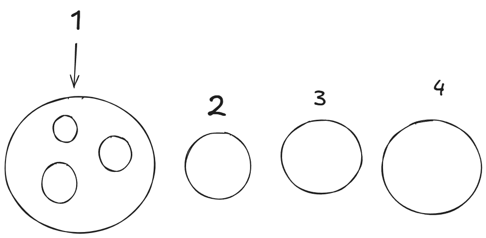

# Lineup

A lightweight, thread-safe queue management library for Go that allows you to control concurrent processing with automatic position tracking.



## Features

- **Thread-safe queue management** - Built with mutex locks for safe concurrent access
- **Concurrent processing control** - Limit the number of items processed simultaneously
- **Automatic position tracking (O(N))** - Items automatically receive their position in the queue
- **Queue item purging** - Remove items from the queue at any time
- **Simple API** - Easy to use with minimal configuration

## Installation

```bash
go get github.com/a4amado/Lineup
```

## Usage

### Purging Items

You can remove items from the queue before they are processed. It's recommended to use `defer` to ensure cleanup:

```go
queue := Lineup.New(Lineup.QueueOptions{
    MaxProcessing: 2,
})

place := queue.Place()
defer place.Purge()

for position := range place.Halt {
    fmt.Printf("Your posiion is %d", position)
}

```
 
### `Queue.Place() *QueueItem`

Adds a new item to the queue and returns a `QueueItem`.

**Returns:** A pointer to a `QueueItem` that can be used to track position and purge the item

**Example:**
```go
item := queue.Place()
```

### `QueueItem.Purge()`

Removes the item from the queue. The item will be skipped during processing.

**Example:**
```go
item.Purge()
```

### `QueueItem.Halt chan int`

A channel that receives the item's position in the queue:
- `1` - The item can proceed (within the processing limit)
- `> 1` - The item is waiting (position in line)

The queue automatically recalibrates positions every 300ms, so items will receive updated positions as the queue progresses.

**Note:** The `Halt` channel continuously receives position updates every 300ms. You should read from it in a loop to track position changes as items move through the queue.

## How It Works

1. When you call `Place()`, a new item is added to the queue
2. A background goroutine continuously recalibrates item positions every 300ms
3. Items within the `MaxProcessing` limit receive position `1` (can proceed)
4. Items beyond the limit receive their actual position in line
5. Items can be purged at any time and will be removed from the queue

## License

See [LICENSE.txt](LICENSE.txt) for details.

## Contributing

Contributions are welcome! Please feel free to submit a Pull Request.

